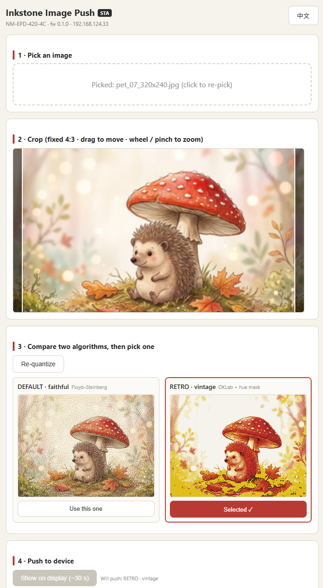

# Inkstone-firmware

[English](README.md) | 简体中文

Inkstone-firmware 为RockBase-iot 为其系列墨水屏设备开发的本地固件，当前支持ESP32 平台。
该项目目前独立于后台服务器运行，后续可配套 Inkstone 云平台使用。

当前Inkstone-firmware 实现了 NM-EPD 系列墨水屏的本地图传固件：零安装、纯本地。配网后浏览器打开设备页面：http://inkstone.local，
选图 → 裁剪 → 预览 → 上传刷屏；AI / 脚本通过带鉴权的 HTTP API 直推。

## 项目特点：

- 设备自托管上传页（STA `inkstone.local` 或 AP `192.168.4.1`），浏览器端 Floyd-Steinberg 四色量化，原始 2bpp 位流直写面板；页面中英双语（默认英文）。
- 新增RETRO抖动算法，与现有Floyd-Steinberg四色量化算法共存，为用户提供两种不一样的图像处理效果。
- `/api/v1/*` Bearer 鉴权 API，raw / JPEG / PNG 三通道，限频保护（ MIN_REFRESH_INTERVAL_S = 60 s），窗口式深度睡眠；
- 支持开放模式（`POST /api/v1/auth {"open":true}`，家用免 token）。
- **支持多 board 框架**：板级常量全部在 `src/boards/*.h`，新增Board参考 [docs/PORTING.md](docs/PORTING.md)。
- **便捷访问**：配网后直接访问 `inkstone.local`，无需查询设备 IP。AP 热点仍为 `Inkstone-XXXXXX`，用于配网时区分设备；同一局域网内只应有一台使用该固定 mDNS 名称的设备。
- 多色预览（如6色墨水屏），支持多分辨率屏幕；
- 通过 API 直推图像，支持 AI 与脚本调用。

## 构建

```bash
pio run -e nm-epd-420-4c        # 编译 + 产出 inkstone-nm-epd-420-4c.bin（0x0 合并固件）
pio run -e nm-epd-420-4c -t upload
```

构建基线：pioarduino 54.x（arduino-esp32 3.1 + IDF 5.3），与
[RockBase-iot/NM-EPD-420](https://github.com/RockBase-iot/NM-EPD-420)
factory 固件一致；依赖 GxEPD2 1.6.8 / JPEGDEC / PNGdec。

## 目录

```
src/boards/      板级定义（board.h 调度，硬件 Ground Truth）
src/display/     display_service（GxEPD2 直写 + 异步刷新）+ image_pipeline（解码量化）
src/net/         wifi_portal（STA/AP/NVS/mDNS）+ web_server + api_server
src/power/       sleep_manager（窗口式深睡）+ battery（ADC）
web/             uploader.html（单文件上传页，构建时 gzip 内嵌）
tools/           convert_image.py（黄金基准）/ push_image.py（AI 调用示例）
scripts/         PlatformIO 构建钩子（页面内嵌 + 固件合并）
docs/            API.md / SLEEP.md / PORTING.md / 项目计划
```

## 快速上手

1. 烧录后无凭据自动开热点 `Inkstone-XXXXXX`（XXXXXX=设备 MAC 后三字节，
   密码 12345678），浏览器开 `http://192.168.4.1` 配网。
2. 配网后访问 `http://inkstone.local` 传图。
3. API token 在 AP 页面与串口日志中查看；调用方式见
   [docs/API.md](docs/API.md) 与 `tools/push_image.py`。
4. 休眠行为见 [docs/SLEEP.md](docs/SLEEP.md)。



